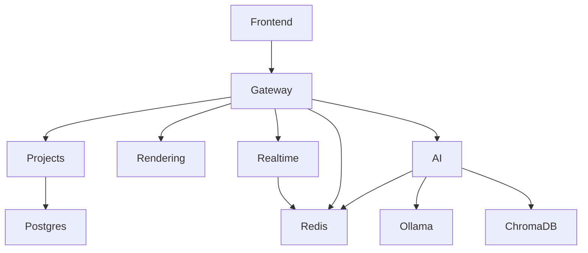

# Nexus Development Hub Architecture

## Overview

Nexus is a self-hosted, AI-augmented development hub designed to amplify developer creativity while maintaining privacy and control over intellectual property.

## System Architecture

### Core Components

1. **Frontend Service (Canvas)**: Next.js application providing the user interface
2. **Gateway Service**: API gateway handling authentication and request routing
3. **Projects Service**: Manages projects, tasks, and user data
4. **Rendering Service**: Processes Mermaid diagrams and converts them to SVG/PNG
5. **Realtime Service**: Handles WebSocket connections for collaborative features
6. **AI Service**: Integrates with local LLMs through Ollama for AI-assisted development
7. **Ollama Service**: Runs local language models for AI features
8. **PostgreSQL**: Primary relational database for structured data
9. **Redis**: Cache and message broker for realtime communications
10. **ChromaDB**: Vector store for AI embeddings and retrieval

### Data Flow

1. User interactions are handled by the Frontend Service
2. API requests are routed through the Gateway Service
3. Business logic is processed by specialized microservices
4. Real-time updates are broadcast through the Realtime Service
5. AI capabilities are provided through the AI Service integrating with Ollama
6. Data is persisted across PostgreSQL, Redis, and ChromaDB based on use case

### Security Model

- JWT-based authentication
- Role-based access control
- Input validation at multiple layers
- Secure communication between services
- Local-only operation by default

## Deployment Architecture

Nexus is designed as a Docker-based microservices architecture with:

- Containerized services for isolation and scalability
- Dedicated network for service communication
- Persistent volumes for data storage
- GPU acceleration for AI workloads
- Health checks and automatic restarts for reliability

## Development Guidelines

See the [Development Guide](development.md) for setup instructions and contribution guidelines.
